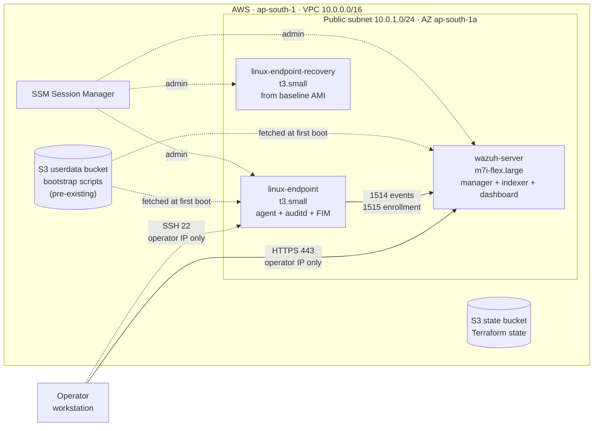
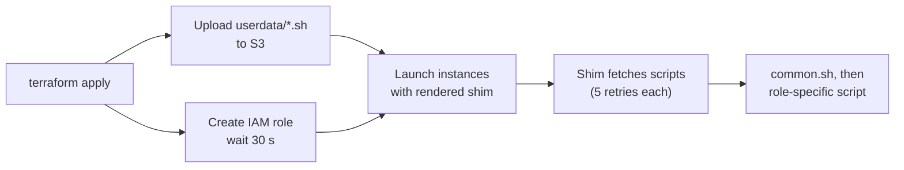
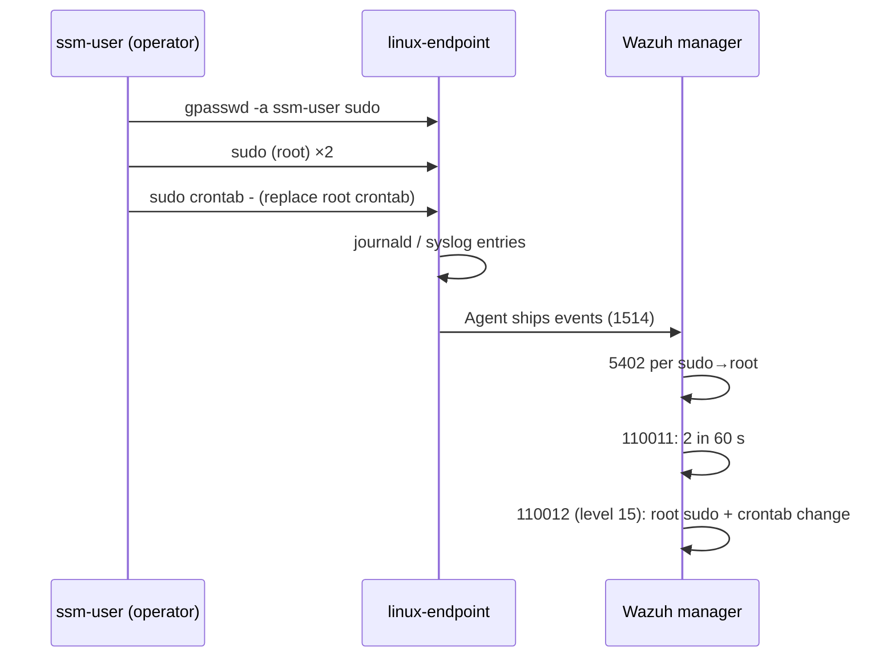
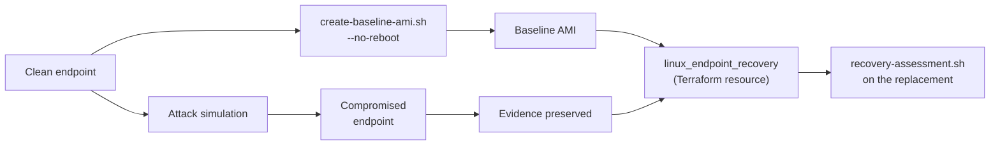

# 🏗️ Architecture

How the lab is built, how data moves through it, and where the security boundaries sit.

**Contents:** [Summary](#summary) · [Components](#components) · [Network](#network) · [Provisioning](#provisioning) · [Detection pipeline](#detection-pipeline) · [Recovery design](#recovery-design) · [Identity & access](#identity--access) · [State & CI](#state--ci) · [Design decisions](#design-decisions) · [Limitations](#limitations)

---

## Summary

Three EC2 instances share one public subnet in a single VPC.

- **`wazuh-server`** (Amazon Linux 2023) runs the Wazuh manager, indexer and dashboard.
- **`linux-endpoint`** (Amazon Linux 2023) is the monitored host. It runs a Wazuh agent, auditd and real-time file integrity monitoring.
- **`linux-endpoint-recovery`** is a replacement launched from an AMI captured *before* the attack simulation.

The operator drives the simulation from an SSM session. Admin access is through SSM, and no key pairs exist.

---

## Components

| Component | Detail |
|---|---|
| **VPC** | `10.0.0.0/16`, DNS support and hostnames on |
| **Public subnet** | `10.0.1.0/24`, single AZ, auto-assigns public IPs |
| **Internet gateway + route table** | `0.0.0.0/0` → IGW |
| **Wazuh manager** | AL2023 · `m7i-flex.large` · 50 GB gp3 · encrypted · Wazuh `4.14` branch |
| **Linux endpoint** | AL2023 · `t3.small` · 20 GB gp3 · encrypted · agent `4.14.7-1` |
| **Recovery endpoint** | `t3.small` · 20 GB gp3 · encrypted · baseline AMI · **no user-data** |
| **Security Groups** | `wazuh_sg`, `linux_endpoint_sg` (shared by endpoint and recovery) |
| **IAM** | One role and instance profile shared by all three instances |
| **S3 userdata** | Holds the scripts instances fetch at boot. **Not created by this repo.** |
| **S3 state** | Terraform remote state. Created by `terraform-bootstrap`. |

All instances enforce **IMDSv2** (`http_tokens = required`). The AMI is pinned (`linux_ami_id`). A `data.aws_ami` lookup exists but nothing references it.

---

## Network

### Security Group rules

| SG | Direction | Port | Source / destination | Purpose |
|---|---|---|---|---|
| `wazuh_sg` | in | 1514/tcp | `linux_endpoint_sg` | Agent event stream |
| `wazuh_sg` | in | 1515/tcp | `linux_endpoint_sg` | Agent enrollment |
| `wazuh_sg` | in | 443/tcp | Operator IP `/32` | Dashboard |
| `wazuh_sg` | out | all | `0.0.0.0/0` | Package downloads, SSM, S3 |
| `linux_endpoint_sg` | in | 22/tcp | Operator IP `/32` | SSH (redundant with SSM) |
| `linux_endpoint_sg` | out | all | `0.0.0.0/0` | Package downloads, SSM, S3 |

Notes:

- **Agent ports reference a Security Group, not a CIDR.** Only members of `linux_endpoint_sg` can reach the manager.
- **The recovery endpoint is in the same Security Group as the original**, so both can reach the manager. Quarantining one means giving it a different group.
- **The operator IP is resolved at apply time** via `icanhazip.com`. If it changes, re-apply.
- **Public IPs are not Elastic.** They change on stop/start.

---

## Provisioning

Instances boot with a **thin shim** that fetches real scripts from S3. Terraform injects configuration only.

### Wazuh manager boot sequence

`wazuh.sh.tpl` fetches and runs, in order:

1. **`common.sh`**: enable SSM agent, wait for internet, create `ssm-user` with passwordless sudo, set timezone, install utilities, Starship (checksum-verified) and `bat`.
2. **`userdata-logs.sh`**: copied to `ssm-user`'s home. Scans bootstrap logs for failures.
3. **`wazuh.sh`**:
   - set hostname `wazuh-server`
   - run the all-in-one installer (`wazuh-install.sh -a`) for the `4.14` branch
   - write the generated admin password to `/home/ssm-user/wazuh-passwords.txt` (mode 600)
   - write the custom rules to `/var/ossec/etc/rules/local_rules.xml`
   - set the dashboard timezone through the API (bounded retry)
   - enable and restart indexer, manager and dashboard

### Linux endpoint boot sequence

`linux-endpoint.sh.tpl` fetches `common.sh` and three helpers (`userdata-logs.sh`, `recovery-assessment.sh`, `simulate_soc_chain.sh`) into `ssm-user`'s home, then runs `linux-endpoint.sh` with configuration passed as environment variables.

| Step | Action |
|:-:|---|
| 1 | Validate that `WAZUH_MANAGER` is set |
| 2 | Add the Wazuh yum repository (GPG-checked) |
| 3 | Wait up to 300 s for the manager's port 1515 |
| 4 | Install the pinned agent version (replace if a different one is installed) |
| 5 | Ensure `auditd` and `crond` are installed and running |
| 6 | Back up `ossec.conf`, then enable real-time FIM on `/etc` and forward `audit.log` |
| 7 | Validate with `wazuh-agentd -t`, restoring the backup on failure |
| 8 | Enable and restart the agent |
| 9 | Verify the agent is running at the expected version |
| 10 | Disable the Wazuh repository |

### Rebuild behavior

Each instance's `user_data` embeds the MD5 of the scripts it uses, and `user_data_replace_on_change = true` turns a hash change into a replacement.

| You change | Replaced |
|---|---|
| `common.sh` | Manager and linux-endpoint |
| `wazuh.sh` or `wazuh.sh.tpl` | Manager, and then linux-endpoint (its `user_data` embeds the manager's private IP) |
| `linux-endpoint.sh` or its `.tpl` | linux-endpoint only |
| `simulate_soc_chain.sh`, `recovery-assessment.sh`, `userdata-logs.sh` | **Nothing.** They are uploaded to S3 but not hashed, so running instances are not refreshed. |

`linux_endpoint_recovery` sets neither `user_data` nor `user_data_replace_on_change`, so script changes never touch it.

---

## Detection pipeline

| Stage | Where | What happens |
|---|---|---|
| Generate | Endpoint | Activity writes sudo, group and cron entries to the journal |
| Collect | Wazuh agent | Forwards journald/syslog, `audit.log`, and FIM events for `/etc` |
| Transport | Agent → manager | TCP 1514, enrollment on 1515 |
| Analyze | Manager | Stock rules plus custom `110010`, `110011`, `110012` |
| View | Indexer + dashboard | `https://<manager>:443` |

Auditd and FIM data are collected but no custom rule uses them yet. Rule logic is in [`detection-rules.md`](detection-rules.md).

---

## Recovery design

The lab treats a root-level compromise as a rebuild case.

| Piece | Role |
|---|---|
| `create-baseline-ami.sh` | Reads the endpoint ID from Terraform output and creates an AMI with `--no-reboot` **before** the simulation. Writes a local `ami_reference_<timestamp>.txt` (git-ignored). |
| `linux_endpoint_baseline_ami_id` | Variable holding the baseline AMI ID. The default is the AMI from the recorded run. |
| `linux_endpoint_recovery` | Terraform resource launched from that AMI, tagged `Recovery = true`. |
| `recovery-assessment.sh` | Case-specific check (sudo group, root crontab, cron spool, execution artifact, marker search). Run before and after recovery. |

The assessment script is deliberately narrow. It is not a forensic scanner.

---

## Identity & access

| Principal | Access | Notes |
|---|---|---|
| EC2 role `terraform-ec2-ssm-role` | `AmazonSSMManagedInstanceCore`, `s3:GetObject` on the userdata bucket, and `ec2:Authorize/RevokeSecurityGroupIngress` plus `Describe*` on `*` | Shared by all three instances. The Security Group permissions are unused and over-broad (see [limitations](#limitations)). |
| `ssm-user` | Passwordless sudo | Created by `common.sh` |
| Operator | AWS credentials for Terraform, SSM for hosts | No key pairs. SSH is open to the operator IP but has no keys to use. |
| Wazuh `admin` | Dashboard login | Password generated at install, stored in `/home/ssm-user/wazuh-passwords.txt` |
| Agent enrollment | No password | `wazuh_registration_password` is empty by default |

---

## State & CI

### Terraform layout

| Module | Backend | Manages |
|---|---|---|
| `terraform-bootstrap` | local | State bucket (encrypted, public access blocked, `force_destroy = true`) |
| `terraform-lab` | S3, `use_lockfile = true` | Network, compute, IAM, S3 script objects |

Terraform ≥ 1.10 is needed for the lab because of `use_lockfile`. The bootstrap module declares ≥ 1.5.

Bucket names must be kept in sync across `terraform-bootstrap/variables.tf` (state bucket), `terraform-lab/backend.tf` (backends cannot use variables), and `terraform-lab/variables.tf` (userdata bucket).

### CI (GitHub Actions)

The workflow runs `terraform fmt -check`, `init -backend=false`, `validate`, and Checkov (non-blocking) against `terraform-lab`.

⚠️ The file lives at `terraform-lab/.github/workflows/terraform.yml`. GitHub reads workflows only from `.github/workflows/` at the repository root, and the job's `working-directory` is `terraform-lab`, so the workflow appears not to run in its current location. `terraform-bootstrap` is not covered either. Moving it is a deliberate change, so it has been left as is.

---

## Design decisions

| Decision | Reason |
|---|---|
| SG-to-SG rules for agent traffic | Only `linux_endpoint_sg` members can enroll. No CIDR upkeep. |
| Dashboard limited to operator IP | The SIEM UI is never open to the internet. |
| Thin shims, logic in S3 scripts | User-data has a 16 KB limit and is hard to debug. Plain scripts are easier to review. |
| Content-hash triggers | A script edit reliably replaces the instance instead of silently doing nothing. |
| Custom rules around reliably forwarded events | During diagnosis, stock `2961` and `2833` did not appear as alerts even though the events existed locally. The custom rules were built around what the endpoint reliably forwarded. |
| Baseline AMI before the attack | Gives a genuine known-good rebuild source. |
| Rebuild over cleanup after root | Cleanup cannot prove nothing else changed. |
| SSM instead of SSH for admin | No keys to manage or rotate. |
| Config edit with backup, validate, rollback | A bad `ossec.conf` cannot take the agent down silently. |

---

## Limitations

- **Single AZ, public subnet, no NAT, no VPC flow logs.** Lab topology. Related Checkov skips are in `.checkov.yaml`.
- **Userdata bucket is assumed to exist.** Nothing in the repo creates it. The bootstrap module creates only the state bucket.
- **Bootstrap variables are not wired.** `enable_versioning`, `bucket_force_destroy` and `kms_key_arn` are declared but unused, so the state bucket has no versioning.
- **Recovery AMI default is account-specific.** On a new account the ID will not exist and must be overridden.
- **Baked-in manager address.** The baseline AMI carries the agent configuration from the clean endpoint, including the manager IP at that time. If the manager is replaced, the recovery endpoint's config may point at a stale address. Untested.
- **Shared IAM role** includes unused, broad Security Group permissions. The Active Response block in `wazuh.sh` that would use them is empty.
- **No isolation or termination workflow.** Containment and host removal are manual and were not done in the recorded run.
- **Wide egress and SSH.** Both Security Groups allow all outbound traffic, and SSH is open to the operator IP.
- **Manager version floats** within the `4.14` branch while the agent is pinned to `4.14.7-1`.
- **One scenario** is implemented (sudo abuse to cron persistence).

---

📎 Related: [`detection-rules.md`](detection-rules.md) · [`incident-report.md`](incident-report.md) · [`lessons-learned.md`](lessons-learned.md) · [`debugging-notes.md`](debugging-notes.md)
