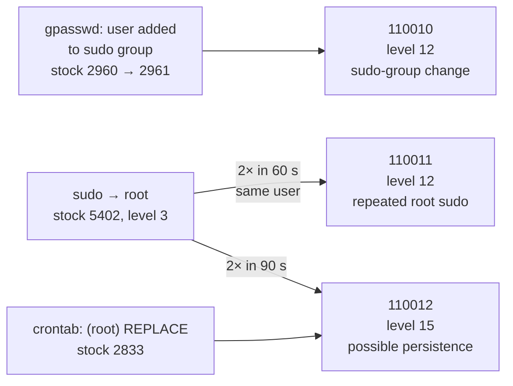

# 🎯 Detection Rules

Three custom Wazuh rules that turn ordinary Linux sudo and cron activity into an escalating privilege-escalation-to-persistence signal.

| | |
|---|---|
| **Rule source** | Heredoc in [`terraform-lab/userdata/wazuh.sh`](../terraform-lab/userdata/wazuh.sh), written to `/var/ossec/etc/rules/local_rules.xml` |
| **Rule IDs** | `110010` · `110011` · `110012` |
| **Log source** | Linux endpoint journald and syslog, forwarded by the Wazuh agent |
| **Stock rules relied on** | `2961` (user added to group), `5402` (successful sudo to root), `2833` (root crontab replaced) |
| **MITRE ATT&CK** | [T1548.003](https://attack.mitre.org/techniques/T1548/003/) Sudo and Sudo Caching · [T1053.003](https://attack.mitre.org/techniques/T1053/003/) Cron · [T1136](https://attack.mitre.org/techniques/T1136/) Create Account |

---

## 💡 The idea

One sudo command is routine. Repeated root execution is worth a look. Repeated root execution **followed by a change to root's crontab** is persistence.

| Observation | Meaning | Rule | Level |
|---|---|:-:|:-:|
| User added to the sudo group | Privilege precursor | `110010` | 12 |
| 2 sudo→root commands in 60 s | Burst of root activity | `110011` | 12 |
| 2 sudo→root in 90 s, then root crontab modified | Possible persistence | `110012` | **15** |



---

## 📖 Rule by rule

### `110010`: user added to sudo group

| | |
|---|---|
| **Level** | 12 |
| **Parent** | `2961` (stock: child of `2960`, expects a `gpasswd`-decoded "added by" event) |
| **Groups** | `privilege_escalation`, `account_manipulation` |
| **MITRE** | T1136, T1548.003 |

Purpose: a marker for the privilege precursor. It fires on the sudo-group change itself.

The stock parent matters. `usermod -aG sudo` does **not** trigger `2961`. `gpasswd -a <user> sudo` does.

---

### `110011`: repeated sudo to root

| | |
|---|---|
| **Level** | 12 |
| **Trigger** | `frequency="2"` within `timeframe="60"` on rule `5402` |
| **Grouping** | `same_user` |
| **Groups** | `privilege_escalation`, `soc_correlation` |
| **MITRE** | T1548.003 |

Purpose: show that correlation works. It is the dependable middle of the chain.

---

### `110012`: root sudo followed by crontab change

| | |
|---|---|
| **Level** | **15** (highest) |
| **Trigger** | Stock `2833` event, with `5402` matched `frequency="2"` within `timeframe="90"` |
| **Groups** | `privilege_escalation`, `persistence`, `soc_correlation` |
| **MITRE** | T1548.003, T1053.003 |

Purpose: flag likely persistence. It triggers on the crontab event, so ordering is built in: the root sudo activity must come first.

`2833` is the end of a stock chain (`2830 → 2832 REPLACE → 2833 REPLACE (root)`) and needs the real `crontab[...]: (root) REPLACE (root)` log line, not just a changed file.

---

## 🔬 What it looks like when it fires

From [`evidence/wazuh/correlation-alerts.json`](../evidence/wazuh/correlation-alerts.json) and [`alert-chain.json`](../evidence/wazuh/alert-chain.json), agent `linux-endpoint`, 9 Sep 2026, dashboard time (IST):

| Time | Rule | Level | Triggering command |
|---|:-:|:-:|---|
| 12:22:38 | `5402` | 3 | `usermod -aG sudo ssm-user` |
| 12:22:44 | **`110011`** | 12 | `whoami` |
| 12:22:50 | **`110011`** | 12 | `whoami` |
| 12:23:22 | **`110011`** | 12 | `crontab -l` |
| 12:23:22 | **`110011`** | 12 | `crontab -` |
| 12:23:22 | **`110012`** | **15** | `crontab[…]: (root) REPLACE (root)` |

`110012` fired 44 s after the first `5402`. In these exports, sudo events after the first appear as `110011` rather than `5402`, so only some sudo events show up as `5402`.

A second burst at 12:30:26 (`110011` ×2) came from the investigation commands themselves (`find`, `grep`). See the [incident report](incident-report.md).

---

## 🧪 Reproducing it

```bash
# on the endpoint, via SSM Session Manager
cd /home/ssm-user
./simulate_soc_chain.sh            # defaults to ssm-user, 5 s between steps

# on the manager
sudo grep -E '"id":"(110010|110011|110012|5402)"' /var/ossec/logs/alerts/alerts.json | tail
```

| Setting | Value | Why |
|---|---|---|
| Gap between steps | 5 s | Keeps events inside the 60 s and 90 s windows with time to evaluate |
| Script requirement | Passwordless sudo for the test user | Steps run with `sudo -n` |

⚠️ **Step 1 differs from the evidence.** The preserved alerts show steps 2 to 4 matching the script (`whoami`, `whoami`, `crontab -l`, `crontab -`), but the first command was `usermod -aG sudo ssm-user`, not the script's `gpasswd -a`. The script may have been revised after the run. No captured run of the current script is preserved.

---

## 🔧 Known gaps and tuning

| Gap | Detail | Possible fix |
|---|---|---|
| **`110010` not observed** | No `110010` alert is preserved. The first step in the evidence is `5402` for `usermod`, which `2961` does not match. The debugging notes record `2961` not appearing during diagnosis. | Re-run the current script (`gpasswd`) and confirm `110010`. Check that the agent forwards the source log. |
| **Noisy by design** | Any two sudo commands in 60 s trip `110011`. The analyst's own investigation did exactly that. | Exclude known admin accounts, or raise the threshold. |
| **Level 12 for a routine event** | `110011` and `110010` are both level 12. | Tune levels per environment. |
| **Loose MITRE fit** | `110010` maps to T1136 (Create Account), but nothing is created. | Consider T1098 (Account Manipulation). |
| **Narrow persistence coverage** | Only root crontab is covered. systemd units and timers, `authorized_keys`, shell startup files are not. | Add rules per surface. |
| **auditd forwarding without rules** | The endpoint forwards `/var/log/audit/audit.log` and watches `/etc` in real time, but no custom auditd or FIM rules are deployed. | Add rules (e.g. auditd stop, T1562.001). |
| **No validation at install** | `wazuh.sh` writes the rules and restarts the manager without running a config test. | Run `wazuh-logtest -t` before restart. |
| **No automated response** | Rules alert, a human responds. The Active Response block in `wazuh.sh` is empty. | Wire Active Response once alerting is trusted. |

---

📎 Related: [`incident-report.md`](incident-report.md) · [`architecture.md`](architecture.md) · [`debugging-notes.md`](debugging-notes.md)
