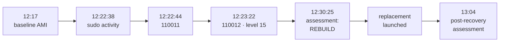
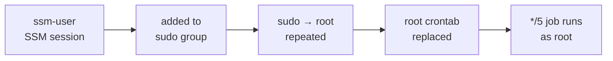

# 🚨 Incident Report: Privilege Abuse and Root Cron Persistence on a Linux Endpoint

> **Exercise record.** This was a controlled simulation in a lab. The "attacker" is the operator, acting through an SSM session as `ssm-user`. The persistence payload only appends a marker line to a log file. The report is written as if it were a real incident to practice the format.

---

## 📋 At a glance

| | |
|---|---|
| **Date** | 9 Sep 2026 (times below are IST, the dashboard time zone) |
| **Type** | Privilege abuse leading to persistence |
| **MITRE ATT&CK** | [T1548.003](https://attack.mitre.org/techniques/T1548/003/) Sudo and Sudo Caching · [T1053.003](https://attack.mitre.org/techniques/T1053/003/) Cron |
| **Affected asset** | `linux-endpoint` (Amazon Linux 2023, Wazuh agent `001`) |
| **Affected account** | `ssm-user` |
| **Highest alert** | Rule `110012`, level 15 |
| **Recovery decision** | **Rebuild** from a known-good AMI |
| **Status** | ⚠️ Recovered, with isolation, host removal and telemetry validation not completed |

---

## 🧭 Summary

On the endpoint, `ssm-user` was added to the sudo group, ran several commands as root, and then replaced root's crontab with a job that runs every 5 minutes. Wazuh correlated the activity into two custom alerts. The second, `110012` at level 15, fired 44 seconds after the first sudo event and flagged possible persistence.

Investigation confirmed the cron entry was installed and had executed. Because the persistence was at root level, the host was treated as untrusted and **rebuilt** rather than cleaned. A replacement endpoint was launched from a baseline AMI captured before the simulation. A targeted assessment found no known persistence on it.

Three steps were not completed: network isolation of the compromised host, its removal, and end-to-end Wazuh telemetry validation on the replacement.

---

## ⏱️ Timeline

Sources: [`correlation-alerts.json`](../evidence/wazuh/correlation-alerts.json), [`alert-chain.json`](../evidence/wazuh/alert-chain.json), [`recovery-assessment.txt`](../evidence/endpoint/recovery-assessment.txt), [`post-recovery-assessment.txt`](../evidence/endpoint/post-recovery-assessment.txt), [`timeline.txt`](../evidence/timeline.txt).

| Time (IST) | Event | Source |
|---|---|---|
| 12:17:33 | Baseline AMI created from the clean endpoint | `timeline.txt` |
| 12:22:38 | `5402` (level 3): `sudo usermod -aG sudo ssm-user` | Alert |
| 12:22:44 | **`110011`** (level 12): `sudo whoami` | Alert |
| 12:22:50 | **`110011`**: `sudo whoami` | Alert |
| 12:23:21 | Root cron spool last modified | Assessment |
| 12:23:22 | **`110011`** ×2: `sudo crontab -l`, `sudo crontab -` | Alert |
| 12:23:22 | **`110012`** (level **15**): `crontab: (root) REPLACE (root)` | Alert |
| 12:28:50 | `5402`: `sudo crontab -l` (investigation) | Alert |
| 12:30:02 | `/tmp/soc-lab.log` last modified (job had run) | Assessment |
| 12:30:25 | Recovery assessment run on `linux-endpoint`: **REBUILD** | Assessment |
| 12:30:26 | `110011` ×2 from the assessment's own `find` and `grep` | Alert |
| 12:34:33–12:34:49 | `crontab -l` and `cat /tmp/soc-lab.log` captured | Screenshot |
| Not recorded | Replacement endpoint launched from the baseline AMI | |
| 13:04:24 | Post-recovery assessment on `recovered-endpoint`: no known persistence | `timeline.txt` |

**Key intervals**

| Interval | Duration |
|---|---|
| First sudo event → first correlation alert (`110011`) | ≈ 6 s |
| First sudo event → persistence alert (`110012`) | ≈ 44 s |
| Persistence alert → assessment started | ≈ 7 min |
| Persistence alert → post-recovery assessment | ≈ 41 to 46 min (see [discrepancies](#-evidence-discrepancies)) |
| Persistence alert → network isolation | **Not applied** |

---

## 🔍 Detection

| Rule | Level | Fired on |
|---|:-:|---|
| `5402` (stock) | 3 | Successful sudo to root |
| `110011` | 12 | 2 sudo→root commands within 60 s |
| `110012` | **15** | 2 sudo→root within 90 s, then a root crontab modification |
| `110010` | 12 | Not present in the preserved evidence |

The correlation worked as designed. Rule logic, and the open question about `110010`, are in [`detection-rules.md`](detection-rules.md).

Screenshot: [`detection-correlation.png`](../evidence/screenshots/detection-correlation.png).

---

## 🛠️ Analysis

**Findings on the endpoint** (pre-recovery assessment, 12:30:25)

| Check | Result |
|---|---|
| Sudo group | `sudo:x:1002:ssm-user`: `ssm-user` is a member |
| Root crontab | Contains `*/5 * * * * /bin/echo SOC_LAB_PERSISTENCE_TEST >> /tmp/soc-lab.log` |
| Cron spool | `/var/spool/cron/root`, owner root, mode 600, modified 12:23:21 |
| Execution | `/tmp/soc-lab.log` exists with 2 marker lines, so the job ran |
| Artifact | `/tmp/soc-lab.log`: root:root, mode 644, 50 bytes, modified 12:30:02 |
| Targeted search | Only `/var/spool/cron/root` contains the marker |

**Attack path**

**Scope of the claim.** The assessment checks only artifacts tied to this chain. It does not prove the host had no other changes, which is why rebuild was chosen over cleanup.

**What the simulation is, and is not.** The simulation requires passwordless sudo for the test user, and `common.sh` grants it when it creates `ssm-user`. The sudo-group step therefore produces a detectable event rather than a real change in privilege.

---

## 🧯 Containment

| Action | Done? |
|---|:-:|
| Preserve evidence (alerts, assessment output, screenshots, timeline) before remediation | ✅ |
| Treat the host as untrusted, do not clean in place | ✅ |
| **Isolate the endpoint from the network** | ❌ |
| Rotate credentials | n/a: SSM-only access, no SSH keys, nothing to rotate |

The compromised endpoint kept its normal Security Group and IAM role and remained reachable during evidence collection.

---

## ♻️ Recovery

### Decision: rebuild

| Question | Answer |
|---|---|
| Was root reached? | Yes, persistence ran as root |
| Can all changes be proven known? | No, only the known indicator was checked |
| Outcome | Rebuild from known-good state |

The reasoning follows the decision matrix in the [debugging notes](debugging-notes.md): root compromise and unknown persistence both point to rebuild.

### Replacement

A replacement endpoint (`linux_endpoint_recovery`) was launched from the baseline AMI captured **before** the simulation. The compromised instance was kept for evidence and **not removed**.

### Post-recovery assessment

Run on `recovered-endpoint` with the same script. Output: [`post-recovery-assessment.txt`](../evidence/endpoint/post-recovery-assessment.txt).

| Check | Result |
|---|---|
| Sudo group | Not present |
| Root crontab | None |
| Root cron spool | None |
| `/tmp/soc-lab.log` | Does not exist |
| Targeted marker search | No matches |
| **Decision** | **NO KNOWN PERSISTENCE FOUND** |

The output states plainly that this "does not constitute proof of full host integrity."

---

## ❓ The five questions

| Question | Answer |
|---|---|
| **What was compromised?** | The `linux-endpoint` host, at root level, through the `ssm-user` account. |
| **How did the attacker keep access?** | A root crontab entry running every 5 minutes. |
| **How was it removed?** | By rebuilding from a known-good AMI, not by deleting the cron entry. |
| **How was recovery proven?** | A targeted assessment on the replacement. Telemetry and detection on the replacement were **not** verified. |
| **What prevents recurrence?** | Correlation rules `110011` and `110012`, plus the open items below. |

---

## 🧩 Contributing factors

| Factor | Detail |
|---|---|
| **Standing sudo** | `ssm-user` has passwordless sudo, so root actions need no further step. |
| **No isolation step** | There is no runbook step or automation to quarantine a host. |
| **Shared, broad IAM role** | All instances share one role that includes `ec2:AuthorizeSecurityGroupIngress` and `RevokeSecurityGroupIngress` on `*`. Not exercised in this run, but root on the endpoint could reach those credentials. |
| **Redundant access path** | SSH (22) is open to the operator IP although access is via SSM. |
| **Same Security Group for both endpoints** | The compromised host and its replacement share one Security Group. |

---

## 📈 What went well, and what didn't

| ✅ Went well | ⚠️ Needs work |
|---|---|
| Correlation caught the chain in 44 s | Compromised host was not isolated |
| Evidence was preserved before remediation | Compromised host was not removed |
| Rebuild chosen over in-place cleanup, with reasons | Telemetry on the replacement was not verified |
| Baseline AMI existed before the attack | No `110010` alert in the evidence |
| The assessment is scripted and was run before and after | Replacement launch time was not recorded |

---

## 📌 Action items

| # | Action | Type | Priority |
|:-:|---|---|:-:|
| 1 | Verify agent connection, ingestion and a test alert on the recovered endpoint | Validation | High |
| 2 | Add an isolation step: swap the host to a deny-all Security Group, then collect evidence | Containment | High |
| 3 | Stop or terminate the compromised instance and log it | Lifecycle | High |
| 4 | Scope or remove the `ec2:*SecurityGroupIngress` permissions on `*` | Hardening | High |
| 5 | Check whether an AMI cloned from an enrolled agent keeps its enrollment identity | Validation | Medium |
| 6 | Re-run the current script and confirm `110010` fires | Detection | Medium |
| 7 | Remove SSH (22) from the endpoint Security Group | Hardening | Medium |
| 8 | Record timestamps for every recovery step | Process | Medium |
| 9 | Correct the date and entry count in `timeline.txt` with a dated erratum | Evidence | Low |

---

## 🔎 Indicators

| Type | Value |
|---|---|
| Account | `ssm-user` |
| Group change | `usermod -aG sudo ssm-user` |
| Cron entry | `*/5 * * * * /bin/echo SOC_LAB_PERSISTENCE_TEST >> /tmp/soc-lab.log` |
| Files | `/var/spool/cron/root`, `/tmp/soc-lab.log` |
| Marker string | `SOC_LAB_PERSISTENCE_TEST` |
| Wazuh rules | `5402`, `110011`, `110012` (stock `2833` as parent) |
| Agent | `001` / `linux-endpoint`, private IP `10.0.1.137` |

---

## 🧾 Evidence discrepancies

Cross-checking the artifacts found inconsistencies. They do not change the findings, but they should be corrected.

| Item | `timeline.txt` | Other evidence |
|---|---|---|
| Incident date | 2026-09-08 | Alert exports and dashboard: **2026-09-09**. The dashboard's time range starts on Sep 8, a likely source. |
| Persistence entries | "eight" | Assessment output and screenshot: **two** |
| Post-recovery assessment time | 13:04:24 | Output file header: **13:09:02** |
| "Additional sudo activity" 12:28 to 12:34 | Listed as separate activity | At least 12:28:50 and 12:30:26 are `crontab -l`, `find`, `grep`: the investigation itself |

---

## 🗂️ References

- Rules: [`detection-rules.md`](detection-rules.md)
- Infrastructure: [`architecture.md`](architecture.md)
- Gaps and lessons: [`lessons-learned.md`](lessons-learned.md)
- Decision framework and debugging: [`debugging-notes.md`](debugging-notes.md)
- Evidence index: [`../evidence/README.md`](../evidence/README.md)
