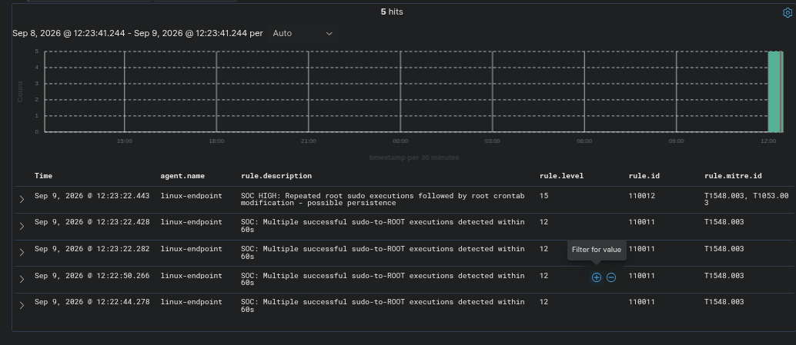
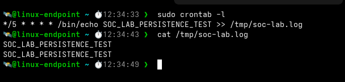

# 🧾 Evidence

Everything produced or captured during the recorded run on **9 Sep 2026** (IST). Each artifact answers one question.

---

## 🗂️ What's here

| File | Answers |
|---|---|
| [`timeline.txt`](timeline.txt) | What happened, in order (see the [caveat](#-known-inconsistencies)) |
| [`wazuh/alert-chain.json`](wazuh/alert-chain.json) | Which `5402` sudo alerts fired |
| [`wazuh/correlation-alerts.json`](wazuh/correlation-alerts.json) | Which `110011` / `110012` correlation alerts fired |
| [`endpoint/recovery-assessment.txt`](endpoint/recovery-assessment.txt) | What was found on the compromised endpoint |
| [`endpoint/post-recovery-assessment.txt`](endpoint/post-recovery-assessment.txt) | What was found on the replacement |
| [`screenshots/detection-correlation.png`](screenshots/detection-correlation.png) | The alerts as an analyst saw them |
| [`screenshots/persistence.png`](screenshots/persistence.png) | The persistence on the host |
| [`ami_reference.example.txt`](ami_reference.example.txt) | Template for recording the baseline AMI |

---

## 🖼️ Screenshots

### 1 · Detection and correlation



Five hits on `linux-endpoint`: `110011` ×4 (level 12) and `110012` (level 15, T1548.003 + T1053.003) at 12:23:22. The earlier `5402` alerts are separate events and are not in this filtered view.

---

### 2 · Persistence on the host



`sudo crontab -l` shows the `*/5` job, and `cat /tmp/soc-lab.log` shows two marker lines, so the job had executed.

---

## 📄 Raw alerts

Concatenated JSON objects, not a JSON array. Parse them with a stream-tolerant reader (e.g. `jq -c .`) rather than `json.loads` on the whole file.

| Rule | Level | Count | File |
|---|:-:|:-:|---|
| `5402` | 3 | 3 | `alert-chain.json` |
| `110011` | 12 | 6 | `correlation-alerts.json` |
| `110012` | 15 | 1 | `correlation-alerts.json` |

---

## 🔁 Reproducing the assessment

```bash
# on the endpoint, via SSM Session Manager
cd /home/ssm-user
sudo ./recovery-assessment.sh        # defaults to ssm-user
```

The script checks six things tied to this case: sudo-group membership, root crontab, root cron spool, the execution artifact, its metadata, and a targeted marker search. It ends with a decision (`REBUILD` or `NO KNOWN PERSISTENCE FOUND`).

It is **not** a forensic scanner. A clean result means the known chain is absent, not that the host is proven clean.

---

## 🏷️ Recording the baseline AMI

`terraform-lab/create-baseline-ami.sh` writes `ami_reference_<timestamp>.txt` next to where it runs. Those generated files are git-ignored. Copy the fields into a file shaped like [`ami_reference.example.txt`](ami_reference.example.txt) if you want to keep a record.

---

## ⚠️ Known inconsistencies

Cross-checking the artifacts found mismatches. The findings are unaffected, but the files disagree. Details in [`docs/incident-report.md`](../docs/incident-report.md#-evidence-discrepancies).

| Item | `timeline.txt` | Other evidence |
|---|---|---|
| Incident date | 2026-09-08 | Alerts and dashboard: 2026-09-09 |
| Persistence entries | "eight" | Assessment and screenshot: two |
| Post-recovery assessment time | 13:04:24 | Output header: 13:09:02 |

The original files have been left untouched so the record is not rewritten after the fact.

---

## 🔒 Before publishing

| Item | Where | Sensitivity |
|---|---|---|
| Private IP `10.0.1.137` | Alert JSON | Not routable. Low risk. |
| Instance and AMI IDs | `timeline.txt`, Terraform defaults | Account-specific. Low risk. |
| Public IPs | None found in the preserved files | Re-check any new screenshots before adding them. |
